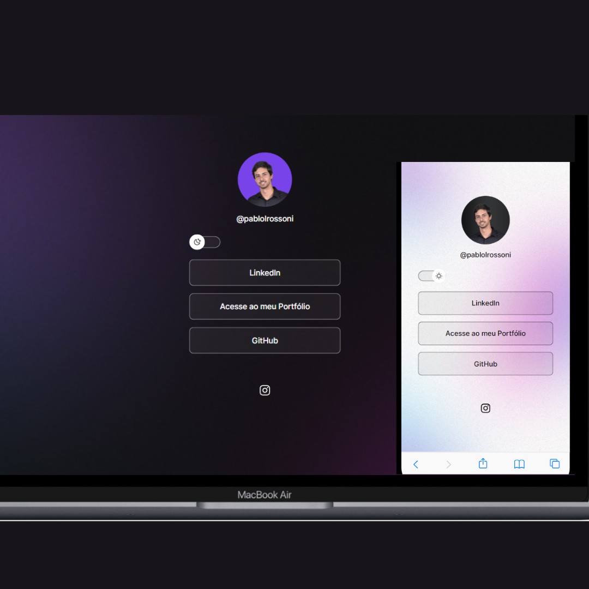

<h1 align="center"> DevLinks</h1>

 
    

<!--

  <a href="#-tecnologias">Tecnologias</a>&nbsp;&nbsp;&nbsp;|&nbsp;&nbsp;&nbsp;
  <a href="#-projeto">Projeto</a>&nbsp;&nbsp;&nbsp;|&nbsp;&nbsp;&nbsp;
  <a href="#-funcionalidades">Funcionalidades</a>&nbsp;&nbsp;&nbsp;&nbsp;

-->
 

## 🚀 Tecnologias

Esse projeto foi desenvolvido com as seguintes tecnologias:

- HTML
- CSS
- JavaScript
- Figma

## 🚧 Projeto

DevLinks é um agregador de links para usar como cartão de visitas online. Com o DevLinks, você pode reunir todos os seus perfis sociais, projetos, portfólio e informações de contato em um só lugar, facilitando para seus visitantes conhecerem mais sobre você e seus trabalhos em um único clique

Live Preview: <a href="https://dev-links-two-kappa.vercel.app/"> Projeto </a>

## layout:

Visualize o layout do projeto através <a href="https://www.figma.com/file/yyS9NMoTDpgkKxOaESOdXQ/DevLinks-%E2%80%A2-Projeto-Discover-(Community)?type=design&node-id=10-620&mode=design&t=OCYa7SANFSdgU5C8-0">DESSE LINK</a>

## Inspiração:

@maykbrito - rocketseat

Feito com ♥ by RossoniPablo
